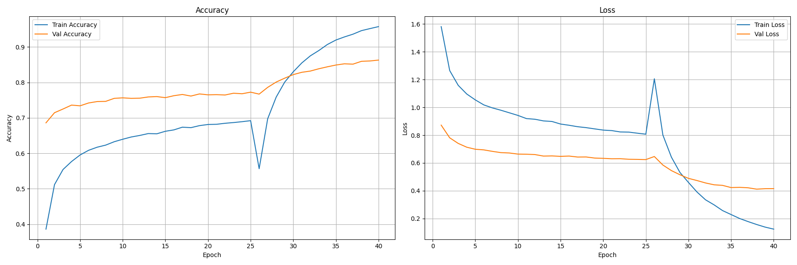
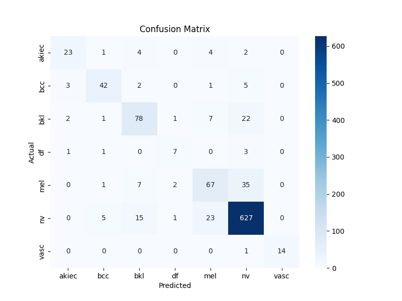
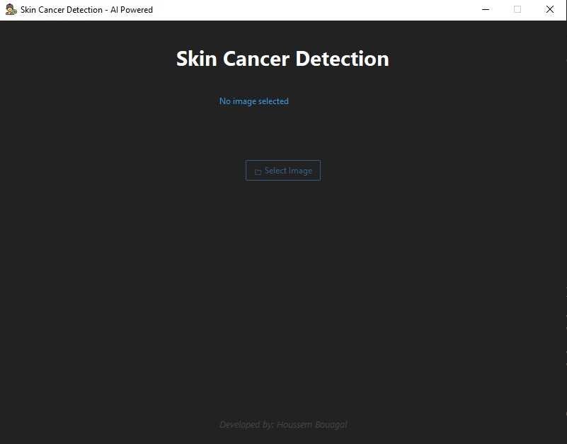

# 🧬 Skin Cancer Detection System (Desktop AI Assistant)

A professional desktop application that uses deep learning to detect and classify skin cancer from dermoscopic images with high accuracy. Built with TensorFlow and equipped with a modern Tkinter GUI using `ttkbootstrap`, this offline AI-powered tool provides a fast and accessible solution for dermatological support and research.

> 📖 **License**: This project is licensed under the [MIT License](#-license).

---

## 💡 Overview

This system analyzes dermoscopic images and classifies them into **seven types of skin lesions**, based on the **HAM10000** dataset:

- **akiec** (Actinic keratoses)
- **bcc** (Basal cell carcinoma)
- **bkl** (Benign keratosis-like lesions)
- **df** (Dermatofibroma)
- **mel** (Melanoma)
- **nv** (Melanocytic nevi)
- **vasc** (Vascular lesions)

---

## 🎯 Model Summary

| Metric                | Value (%)     |
|-----------------------|---------------|
| Training Accuracy     | 95.74         |
| Validation Accuracy   | 86.30         |
| Testing Accuracy      | 85.12         |
| Model Used            | EfficientNetB1|
| Training Epochs       | 25 epochs + 15 fine-tuning |

---

## 📈 Accuracy & Loss Curves



---

## 📊 Confusion Matrix


*Confusion Matrix for the 7 skin cancer classes.*

---

## 📋 Classification Report

```
              precision    recall  f1-score   support

       akiec       0.79      0.68      0.73        34
         bcc       0.82      0.79      0.81        53
         bkl       0.74      0.70      0.72       111
          df       0.64      0.58      0.61        12
         mel       0.66      0.60      0.63       112
          nv       0.90      0.93      0.92       671
        vasc       1.00      0.93      0.97        15

    accuracy                           0.85      1008
   macro avg       0.79      0.75      0.77      1008
weighted avg       0.85      0.85      0.85      1008
```

## 🖥️ Application UI



### Features:
- 📁 Browse and load dermoscopic images.
- 🤖 Instant AI-based prediction using a trained EfficientNet model.
- ✅ Visual comparison between predicted and actual class.
- 🧼 Sleek, modern interface with `ttkbootstrap`.

---

## ▶️ How to Run

### 1. Clone the repository:

```bash
git clone https://github.com/HoussemBouagal/Skin-Cancer-Detection.git
cd Skin-Cancer-Detection
```

### 2. Install required dependencies:

```bash
pip install -r requirements.txt
```

### 3. Launch the app:

```bash
python main.py
```

---

## 🧪 Tech Stack

- Python 3.x  
- TensorFlow & Keras  
- EfficientNetB1  
- Image Size: 240x240 RGB  
- Tkinter + ttkbootstrap  
- PIL, OpenCV, NumPy  

---

## 📦 Requirements (requirements.txt)

```txt
tensorflow
numpy
pillow
opencv-python
ttkbootstrap
```

---

## 🗂️ Project Structure

```
SkinCancerDetection/
│
├── test/
│   ├── akiec/
│   ├── bcc/
│   ├── bkl/
│   ├── df/
│   ├── mel/
│   ├── nv/
│   ├── vasc/
│
├── assets/
│   ├── app_interface.jpg
│   ├── accuracy_curve.png
│   ├── confusion_matrix.png
│   ├── akiec.jpg
│   ├── bcc.jpg
│   ├── bkl.jpg
│   ├── df.jpg
│   ├── mel.jpg
│   ├── nv.jpg
│   ├── vasc.jpg
│
├── skin_cancer_model.keras
├── skin-cancer.ico
├── main.py
├── requirements.txt
├── LICENSE                     
└── README.md
```

---

## 📄 License

This project is licensed under the **MIT License**.

Read the full license in the [LICENSE](LICENSE) file.

---

## ⚠️ Disclaimer

> This tool is intended for **educational and research purposes only**. It is **not certified for clinical or diagnostic usage**.

---

## 👤 Author

**Houssem Bouagal**  
📧 Email: [mouhamedhoussem813@gmail.com](mailto:mouhamedhoussem813@gmail.com)  
🔗 LinkedIn: [Houssem Bouagal](https://www.linkedin.com/in/houssem-eddine-bouagal-98025a297)  
🌐 Portfolio: [houssembouagal.github.io/Portfolio/](https://houssembouagal.github.io/Portfolio/)

---

